## Hi there 👋 I'm Ibraimova Ramina
**🛡️Cybersecurity / 💻Computer Science / 🏫National School of Physics & Math (FIZMAT)**

## 👩‍💻 About Me
I am the founder and director of the **GuardAurora**, **SolEstate** and **Verix** projects

### [🛡️ GuardAurora Web App](https://romiisromie.github.io/GuardAurora-Web/)

### [🏫 Verix Web App](https://romiisromie.github.io/verix/)

### 🏆 Achievements & Education
* **🥇 Gold Award @ Koala Mathematics Olympiad (KMO 2026)** — International achievement in Math.
* **🥇 1st Place @ Fizmat Engineering Contest** — Team leader, overall victory among 10th grades.
* **🚀 Top-20 Finalist @ GIRLS GO FIRST Startup Contest 2026** — Recognized for entrepreneurial excellence.
* **🔬 Fizmat Science Fair Finalist** — Computer Science project finalist.
* **🤝 100+ Volunteer Hours**

## 📫 How to reach me:
LinkedIn: www.linkedin.com/in/ramina-ibraimova-b8abb337a

Instagram: https://www.instagram.com/romiisromie/

### 📊 My GitHub Stats

